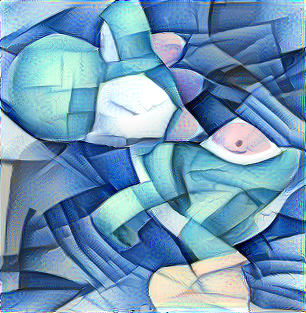

# neuralStyleTF_automate

This repository provides a wrapper for the [neural-style-tf](https://github.com/cysmith/neural-style-tf) package. It automates running images with different styles over the art-style-transfer routine.

<hr>

##  Instructions

To run the script simply call the following comand on the terminal:

```bash
python main.py IMG_PATH STYLES_FOLDER OUT_PATH IMG_SIZE ITERATIONS_NUMBER
```

For example:

```bash
python main.py ./image_input/yoshi.png ./styles/ ./image_output/ 500 500
```


##  Dependencies

Needs the installation of [tensorflow](https://www.tensorflow.org/install/pip) and [opencv](https://pypi.org/project/opencv-python/):

```bash
pip install tensorflow
pip install opencv-python
```

Additionally, [neural-style-tf](https://github.com/cysmith/neural-style-tf) requires a copy of the [VGG-19 model weights ](http://www.vlfeat.org/matconvnet/models/imagenet-vgg-verydeep-19.mat) to be stored in the same directory as the [neural_style.py](https://github.com/Chipdelmal/neuralStyleTF_automate/blob/master/neural_style.py) script (the main directory of this repository).

##  Disclaimer

The [neural_style.py](https://github.com/Chipdelmal/neuralStyleTF_automate/blob/master/neural_style.py) script was coded by the authors of the [neural-style-tf](https://github.com/cysmith/neural-style-tf) package. This repository acts as a wrapper around it, so that batch-stylizing images is easier.

<hr>

# Author

<br>

[Héctor Manuel Sánchez Castellanos](https://chipdelmal.github.io/)
